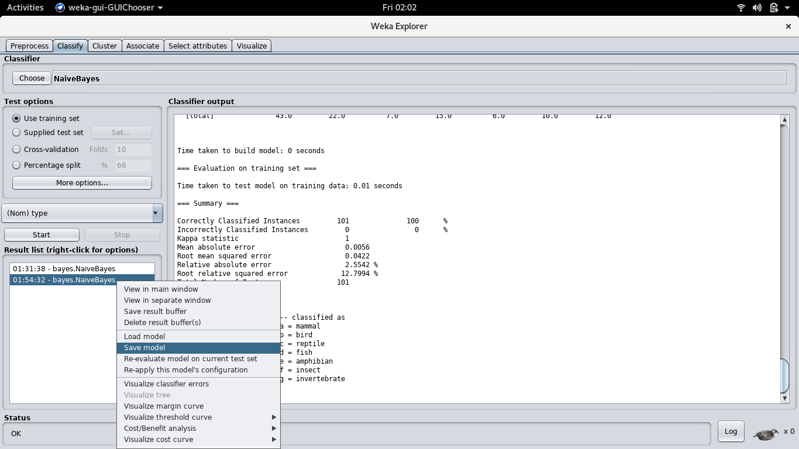

## Introdução a Machine Learning utilizando o Weka
### Veja como é simples utilizar esta ferramenta para construir um modelo de aprendizado de máquina.

O campo de Machine Learning pode ser um tanto obscuro para quem deseja iniciar seu aprendizado nele, porém meu objetivo neste artigo é mostrar o quão fácil pode ser iniciar o aprendizado utilizando o Weka. 

Primeiramente, o que é o Weka? O Weka é uma coleção de algoritmos de Machine Learning e Data Mining escrita em Java na Universidade de Waikato, Nova Zelândia. Por ser um arquivo .jar, utilizá-lo em código Java torna-se trivial, porém neste exemplo usaremos sua GUI pela facilidade e didática.

Este artigo será um passo a passo de como utilizar o Weka para, através de um algoritmo Naive Bayes, classificar um animal de acordo com suas características em 7 diferentes Classes de animais.

Caso você não saiba do que se trata o algoritmo Naive Bayes, aqui vai uma explicação:

O Algoritmo Naive Bayes se trata de um algoritmo de Classificação (existem outros tipos no campo da ciência de dados, como algoritmos de clustering e associação, porém não irei entrar em detalhes neste artigo). Neste caso, é uma Classificação Supervisionada, pois o _dataset_ que iremos utilizar teve um _agente supervisor_, ou seja, alguma pessoa que analisou os dados e os classificou de acordo com suas características manualmente.
Tal algoritmo funciona bem no nosso caso, porém ele supõe que todos os elementos preditores sejam independentes entre si, o que não é o caso em todos os datasets (normalmente temos atributos dependentes entre si).

Suponhamos que tenhamos o dataset abaixo, um exemplo clássico, que elenca várias opções e classifica se a pessoa irá ou não jogar golf no dia. Dizemos que cada linha dessa tabela é uma _instância_, sendo as quatro primeiros colunas consideradas _atributos_ dessa instância e a última coluna é o que chamamos de _classe_ (o valor a ser previsto pelo algoritmo com base nos atributos).


 
O que nós precisamos fazer é montar uma tabela para cada um dos quatro atributos geradores da classe Jogar, obtendo a porcentagem de chance da classe ser Sim ou Não baseada no atributo, e a porcentagem de ocorrências do atributo no Total de instâncias.


E ainda precisamos de uma tabela com a porcentagem de ocorrência das classes em relação ao total de instâncias.


Certo, agora sabemos a probabilidade da pessoa Jogar ou não, com base em cada um dos atributos isoladamente. 

Caso recebamos, digamos, a seguinte instância:

X = (Clima = Ensolarado, Temperatura = Fria, Umidade = Alta, Vento = Forte)

Primeiro, veremos, nas cinco tabelas, a probabilidade de Jogar ser Sim:

Prob. (Clima = Ensolarado | Jogar = Sim) -> 2/9

Prob. (Temperatura = Fria | Jogar = Sim) -> 3/9

Prob. (Umidade = Alta | Jogar = Sim) -> 3/9

Prob. (Vento = Forte | Jogar = Sim) -> 3/9

Prob. (Jogar = Sim) -> 9/14

Então, multiplicaremos esses valores:


Obs: Prob.(X | Jogar = Sim) refere-se às probabilidades dos atributos específicos da instância X com a classe Sim(no caso, os primeiros 4 valores calculados anteriormente).

Prob.(X | Jogar = Sim) * Prob. (Jogar = Sim)

(2/9 * 3/9 * 3/9 * 3/9) * (9/14) = 0.0053

E faremos o mesmo para a probabilidade de não jogar.

Prob.(X | Jogar = Não) * Prob.(Jogar = Não)

(3/5 * 1/5 * 4/5 * 3/5) *  (5/14) = 0.0206

Então:

Prob. (Jogar = Sim | X) = 0.0053 

Prob. (Jogar = Não | X ) = 0.0206 

Agora vamos calcular o percentual:

Chance de Jogar = 0.0053 / (0.0206 + 0.0053) = 20,46%

Chance de Não Jogar = 0.0206 / (0.0206 + 0.0053) = 79,54%

Ou seja, para esta instância, a classe teria o valor Não.

Ainda existe o conceito da suavização, utilizada quando existem valores sem nenhuma ocorrência, empregado para resolver o problema de frequência zero no cálculo.

Vamos analisar a seguinte probabilidade, para exemplificar:

Prob.(Clima = Nublado | Jogar = Não) = 0/5 = 0

Isso cria um problema no cálculo da probabilidade, pois o valor sempre será 0 quando esta evidência for utilizada. Ou seja, para o nosso modelo gerado, caso o clima fosse nublado, sempre a resposta para Jogar seria Sim, pois ao calcular a probabilidade de ser Não ocorreria uma multiplicação por 0, zerando o valor.

É aplicada, então, uma técnica de suavização no nosso dataset (normalmente, a estimação de Laplace). O que será feito é, basicamente, adicionar registros fictícios no nosso dataset: finja que viu tal ocorrência k vezes mais (normalmente 1).

Na prática, cada uma das tabelas de probabilidade obedeceria a seguinte fórmula:


Ou seja, aplicando na tabela de probabilidade de jogar conforme o clima:


Antes, Prob.(Clima = Nublado | Jogar = Não) era 0.

Agora, Prob.(Clima = Nublado | Jogar = Não) é de 1/8.

Isto se repete para todas as tabelas, inclusive a de Total de instâncias.


Agora, vamos calcular a porcentagem para a seguinte instância (já com a estimativa de Laplace):

X = (Clima = Nublado, Temperatura = Fria, Umidade = Alta, Vento = Forte)

Prob. (Jogar = Sim | X) = Prob.(Clima = Nublado | Jogar = Sim) * Prob.(Temperatura = Fria | Jogar = Sim) * Prob.(Umidade = Alta | Jogar = Sim) * Prob.(Vento = Forte | Jogar = Sim) * Prob.(Jogar = Sim)

Substituindo:

Prob. (Jogar = Sim | X) = (5/12) * (4 / 12) * (4/11) * (4/11) * (10/16)

Prob. (Jogar = Sim | X) = 0.01147842056

Mesma coisa para a probabilidade de ser não:

Prob. (Jogar = Não | X) = Prob.(Clima = Nublado | Jogar = Não) * Prob.(Temperatura = Fria | Jogar = Não) * Prob.(Umidade = Alta | Jogar = Não) * Prob.(Vento = Forte | Jogar = Não) * Prob.(Jogar = Não)

Prob. (Jogar = Não | X) = (1/8) * (2/8) * (5/7) * (4/7) * (6/16)

Prob. (Jogar = Não | X) = 0.00478316326

Calculando a Porcentagem:

Sim = 0.01147842056 / (0.01147842056 + 0.00478316326) * 100 = 70.5861168694 %

Não = 0.00478316326 / (0.01147842056 + 0.00478316326) * 100 = 29.4138831306 %

Submetendo a instância ao modelo Naive Bayes que treinei no Weka (e que lhe ensinarei como fazer em seguida) obtive o seguinte resultado:

```
=== Predictions on test set ===

    inst#     actual  predicted error prediction
        1        1:?      1:yes       0.706 
```
Ou seja, ele preveu que a resposta seria Sim, com a porcentagem de 70.6%, conforme fizemos em nossos cálculos. 

## Utilizando o Weka

Que emoção, vamos finalmente pôr a mão na massa.

1º Passo - Baixe e instale o Weka (link e instruções de instalação [aqui](https://www.cs.waikato.ac.nz/ml/weka/downloading.html)).

2º Passo - Baixe o dataset dos Animais [aqui](http://tunedit.org/repo/UCI/zoo.arff).

Certo, primeiro de tudo, abra esse arquivo .arff em um editor de texto, e vamos analisá-lo.

No início há muitos comentários explicando definições sobre o dataset, passando uma overview dos atributos e etc. Vou focar mais na parte técnica nas explicações.

`@RELATION zoo` 

Este atributo simplesmente define o nome do dataset, normalmente é igual ao nome do arquivo.

```
@ATTRIBUTE animal {aardvark,antelope,bass,bear,boar,buffalo,calf,carp,catfish,cavy,cheetah,chicken,chub,clam,crab,crayfish,crow,deer,dogfish,dolphin,dove,duck,elephant,flamingo,flea,frog,fruitbat,giraffe,girl,gnat,goat,gorilla,gull,haddock,hamster,hare,hawk,herring,honeybee,housefly,kiwi,ladybird,lark,leopard,lion,lobster,lynx,mink,mole,mongoose,moth,newt,octopus,opossum,oryx,ostrich,parakeet,penguin,pheasant,pike,piranha,pitviper,platypus,polecat,pony,porpoise,puma,pussycat,raccoon,reindeer,rhea,scorpion,seahorse,seal,sealion,seasnake,seawasp,skimmer,skua,slowworm,slug,sole,sparrow,squirrel,starfish,stingray,swan,termite,toad,tortoise,tuatara,tuna,vampire,vole,vulture,wallaby,wasp,wolf,worm,wren}
@ATTRIBUTE hair {false, true}
@ATTRIBUTE feathers {false, true}
@ATTRIBUTE eggs {false, true}
@ATTRIBUTE milk {false, true}
@ATTRIBUTE airborne {false, true}
@ATTRIBUTE aquatic {false, true}
@ATTRIBUTE predator {false, true}
@ATTRIBUTE toothed {false, true}
@ATTRIBUTE backbone {false, true}
@ATTRIBUTE breathes {false, true}
@ATTRIBUTE venomous {false, true}
@ATTRIBUTE fins {false, true}
@ATTRIBUTE legs INTEGER [0,9]
@ATTRIBUTE tail {false, true}
@ATTRIBUTE domestic {false, true}
@ATTRIBUTE catsize {false, true}
@ATTRIBUTE type { mammal, bird, reptile, fish, amphibian, insect, invertebrate }
```

Aqui são definidos os atributos que constituem cada instância no Dataset, e seus possíveis valores. Por exemplo,o atributo animal é um dentre varios valores possíveis, bem como o atributo type. O atributo legs é um tipo inteiro, num intervalo de 0 a 9, e os demais são booleans (true ou false).

Por padrão, o último atributo definido é considerado o atributo de classe (o atributo a partir do qual será gerado o modelo, bem como o que o modelo gerado irá calcular, neste caso, o type, escolhendo um dentre os 7 valores).

```
@DATA
%
% Instances (101):
%
aardvark,true,false,false,true,false,false,true,true,true,true,false,false,4,false,false,true,mammal
```

A partir daqui, são inseridos os valores de instâncias do dataset, com os atributos sendo passados na mesma ordem que foram definidos.
Caso um dos atributos não tenha valor definido, você passa '?' como o valor dele. Veremos isto depois, quando formos calcular o type de uma instância.
Ou seja, caso não soubessemos que um _aardvark_ (em português, Porco-formigueiro) fosse um mamífero, passariamos a seguinte instância para nosso modelo gerado calcular: 
```
aardvark,true,false,false,true,false,false,true,true,true,true,false,false,4,false,false,true,?
```

Ok, agora que você já entende como funcionam os datasets no Weka, abra o programa e clique no botão Explorer.

O que faremos agora é clicar no botão Open File, e selecionar o arquivo zoo.arff que você baixou anteriormente.

Você deve estar com uma vista assim. Nesta aba, nós conseguimos visualizar as instâncias do dataset e seus atributos, filtrando graficamente por atributo. Nesta imagem podemos ver, por exemplo, que existe apenas uma instância de cada animal, exceto pelo sapo, que tem duas instâncias no dataset.


Selecionando o atributo Milk, por exemplo, podemos ver que todas as instâncias em que ele é verdadeiro foram classificadas como Mamíferos. Faz sentido, não?


Selecionando o atributo Type, podemos ver quantas instâncias pertencem a cada tipo. 


Certo, o que faremos agora é gerar o modelo utilizando o algoritmo Naive Bayes. 

Clique na aba Classify, depois clique na opção Choose e selecione o NaiveBayes, conforme imagem.


Em Test Options, selecione a opção Use training set. O que isto vai fazer é utilizar o arquivo .arff que você carregou anteriormente para treinar o modelo de dados. Clique em Start.

O output imprimiu muita coisa interessante, não?
Vamos repassá-las uma a uma.

Esta matriz é similar à que montamos no exemplo anterior, desta vez para o atributo animal deste dataset. 


Ué, mas como assim, existe 1 animal desses em todas as classes? Isso ocorre pois foi aplicado o processo de suavização, que expliquei antes.

Agora, temos nosso modelo construído e que será testado. 


Na parte de cima, temos o relatório do nosso dataset original submetido ao modelo gerado pelo algoritmo Naive Bayes. _Correctly Classified Instances_ é a quantidade de instâncias que, submetidas ao modelo gerado, foram classificadas igual à sua classificação no dataset original. Neste caso, obtivemos 100% de sucesso, pois é um dataset relativamente eficiente, contendo vários atributos e variabilidade em suas instâncias.

A _Confusion Matrix_ (matriz de confusão) deve ser lida assim:
à direita está a classe original da instância, conforme classificada no dataset inicial. Na parte de cima está a classe definida pelo algoritmo Naive Bayes gerado. Ou seja, qualquer desvio da diagonal principal significa um erro.

Estamos quase lá, falta exportar o nosso modelo gerado e testá-lo com um animal que quisermos. 

Selecione o ultimo result do seu modelo na aba Result list, clique com o mouse direito e escolha a opção Save model. Escolha um nome para o arquivo e salve-o como um arquivo .model.



Certo, já temos o modelo gerado, falta escolher um animal e vamos testá-lo agora. 


Canguru, eu escolho você!

Vamos, então, analisar as características de um Canguru, conforme nosso modelo.


Vamos criar nosso próprio arrf agora para ver como o modelo gerado se comporta. Crie um arquivo .arff novo copiando o texto deste.

```
@RELATION zoo

@ATTRIBUTE animal {kangaroo}
@ATTRIBUTE hair {false, true}
@ATTRIBUTE feathers {false, true}
@ATTRIBUTE eggs {false, true}
@ATTRIBUTE milk {false, true}
@ATTRIBUTE airborne {false, true}
@ATTRIBUTE aquatic {false, true}
@ATTRIBUTE predator {false, true}
@ATTRIBUTE toothed {false, true}
@ATTRIBUTE backbone {false, true}
@ATTRIBUTE breathes {false, true}
@ATTRIBUTE venomous {false, true}
@ATTRIBUTE fins {false, true}
@ATTRIBUTE legs INTEGER [0,9]
@ATTRIBUTE tail {false, true}
@ATTRIBUTE domestic {false, true}
@ATTRIBUTE catsize {false, true}
@ATTRIBUTE type { mammal, bird, reptile, fish, amphibian, insect, invertebrate }

@DATA
kangaroo,true,false,false,true,false,false,false,true,true,true,false,false,2,true,false,false,?
```

O que eu fiz foi criar uma nova instância, preenchendo-a com as características de um Canguru, exceto a classe (que queremos prever). Cangurus são mamíferos, então vamos ver como o sistema se comporta.

Vá para a aba Preprocess novamente, e carregue este arff. Após isso, vá para a aba Classify.

Clicando com o mouse direito na Result list, aparece a opção "Load Model". Selecionando esta opção, escolha o arquivo .model que criamos antes. Agora, clique no botão More options...,  e em Output predictions selecione a opção PlainText.
Clique com o mouse direito na Result list, novamente, e selecione a opção Re-evaluate model on current test set. E, VOILÁ!


O que isso quer dizer é que, para a primeira instância lida do dataset (nosso ilustre Canguru), a classe era desconhecida, foi prevista como mamífero, sem erros apontados e com porcentagem de 100% (o modelo conclui que há uma chance de 100% de ser um mamífero).

Bem, foi isto, pessoal. Espero que tenham achado fácil e gostado de aprender um pouco sobre Machine Learning e sobre o Weka, e até a próxima!

Referências:

[Machine Learning – Naive Bayes Classifier](https://computersciencesource.wordpress.com/2010/01/28/year-2-machine-learning-naive-bayes-classifier/)

[HOW THE NAIVE BAYES CLASSIFIER WORKS IN MACHINE LEARNING](http://dataaspirant.com/2017/02/06/naive-bayes-classifier-machine-learning/)

[Naive Bayes Classifier TutoriaL - Edureka](https://www.slideshare.net/EdurekaIN/naive-bayes-classifier-tutorial-naive-bayes-classifier-example-naive-bayes-in-r-edureka)
